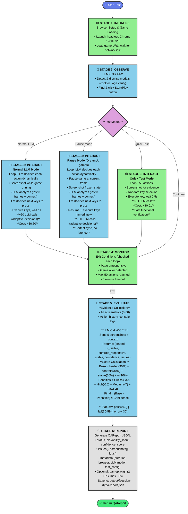

# DreamUp QA Agent - Flow Diagram

**Legend:** 🔵 Blue = LLM Operations | 🟢 Green = Browser Automation | 🟡 Yellow = Data Processing



## Mode Comparison

| Aspect | Normal LLM | Pause Mode | Quick Test |
|--------|-----------|------------|------------|
| **LLM Calls** | ~52 calls | ~52 calls | **3 calls** |
| **Cost** | $0.40-0.60 | $0.40-0.60 | **$0.02-0.03** |
| **Gameplay** | LLM-driven | LLM-driven (paused) | Random keys |
| **Duration** | 45-60s | 45-60s | **30-45s** |
| **Use Case** | 3rd-party games | DreamUp games | Fast verification |

## Key Differentiators

### Stage 3 (INTERACT) - The Critical Difference
- **Normal LLM & Pause Mode**: 🔵 LLM makes **adaptive decisions** for each action
  - Analyzes last 3 frames for velocity/direction
  - Reviews action history for context
  - Dynamically decides next keys to press
  - ~50 LLM calls → ~$0.50/test
- **Quick Test**: 🟢 Random key selection, no LLM analysis during gameplay (~$0.01)
- **All modes**: 🔵 Use identical LLM evaluation at the end for scoring

### Stage 5 (EVALUATE) - Score Components
```
Base Score (0-100):
  ✅ Loaded (30%) + ✅ Controls (30%) + ✅ Stable (30%) + ✅ UI Visible (10%)

Penalties:
  ❌ Critical (-30) | High (-15) | Medium (-7) | Low (-3)

Final Score:
  (Base - Penalties) × LLM Confidence → Clamped to [0, 100]

Status:
  pass (≥60) | fail (30-59) | error (<30 or has critical issues)
```

