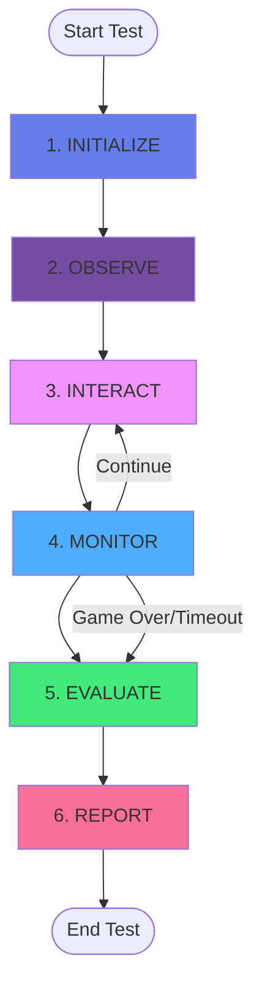

# Product Requirements Document: DreamUp Browser Game QA Pipeline

## Document Control
- **Product Name:** DreamUp QA Agent
- **Version:** 1.1
- **Date:** November 4, 2025
- **Owner:** Matt Smith
- **Status:** In Development
- **Project Duration:** 3-5 days (core) + 2 days (stretch features)
- **Change Log:**
  - v1.1 (Nov 4): Added F1.3b Input Control Hints, updated API interfaces, added US-1.0
  - v1.0 (Nov 3): Initial PRD from project specification

---

## Executive Summary

### Product Vision
An autonomous AI-powered QA agent that tests browser-based games through simulated user interactions, visual analysis, and intelligent evaluation—enabling automated quality assurance for AI-generated games and creating feedback loops for continuous improvement of game-building agents.

### Problem Statement
Currently, DreamUp's AI game generator lacks automated quality assurance capabilities. Manual testing is time-consuming, inconsistent, and doesn't scale. Game developers need immediate feedback on whether generated games are playable, stable, and meet basic quality standards.

### Solution
A fully automated QA pipeline that accepts any browser game URL, simulates realistic user interactions, captures visual evidence, and produces structured quality reports using AI-powered analysis.

### Success Metrics
- **Primary:** Successfully test 3+ diverse browser games with 80%+ accuracy on playability assessment
- **Secondary:** Average test completion time < 5 minutes per game
- **Quality:** Handle common failure modes gracefully (crashes, slow loads, rendering issues)
- **Developer Experience:** Clean, documented, modular codebase ready for production integration

---

## Product Overview

### Target Users

#### Primary Users
1. **Game Development Agent (Automated)**
   - Invokes QA agent programmatically after game generation
   - Consumes structured JSON output for self-improvement
   - Runs in AWS Lambda environment

2. **DreamUp Engineers**
   - Debug and validate QA agent behavior
   - Review test reports for system improvements
   - Configure and deploy QA pipeline

#### Secondary Users
3. **Game Developers (Future)**
   - Manual QA testing of custom browser games
   - Batch testing of game portfolios

### Use Cases

**Primary Use Case:** Automated Post-Generation QA
- Game-building agent generates browser game
- Invokes QA agent with game URL
- Receives structured pass/fail report within 5 minutes
- Uses feedback to improve next generation attempt

**Secondary Use Cases:**
- Manual QA of existing browser games
- Regression testing of game templates
- Comparative analysis across multiple game versions

---

## Game Engine Context (v1.3)

### Scene Stack Architecture

DreamUp's game engine uses a scene-based architecture with four types:
- **Canvas2D & Canvas3D**: Full ECS runtimes with physics, rendering, and game logic
- **UI scenes**: Pure DOM elements for menus and overlays
- **Composite scenes**: Layer multiple child scenes together

Games are represented as a stack of scenes with push/pop operations. A common pattern is a composite scene containing a 2D/3D game scene with a UI overlay for the HUD. UI scenes can suspend scenes beneath them (e.g., pause menus), while composite scenes manage suspension state and propagate lifecycle calls (mount, unmount, update, draw) to all children.

### Input System Architecture

The input system uses a two-layer architecture:

**Low-level**: Hardware capture (keys, mouse, pointer)

**High-level**: Gameplay abstractions
- **Actions**: Map multiple inputs to named gameplay events (e.g., "Jump")
  - Track states: pressed, down, released, hold duration
  - Bind to keyboard keys, mouse buttons, or virtual buttons
  - Example: `createAction('Jump').bindKey(' ').bindVirtualButton('#btn-jump')`

- **Axes**: Provide continuous values for movement
  - **1D Axes**: Return [-1, 1] with smoothing and opposite-direction cancellation
  - **2D Axes**: Return vectors {x, y} with diagonal normalization
  - Bind to WASD, arrow keys, virtual joysticks, D-pads
  - Example: `createAxis2D('Move').bindWASD().bindArrowKeys()`

Actions and axes decouple game logic from hardware—multiple input sources trigger the same action or axis, allowing keyboard, touch, and virtual controls to work interchangeably. Game code queries these abstractions through a scene's InputManager.

### QA Agent Integration

The game-building agent picks the input schema during game planning. For QA testing:
- **First-party games**: Provide JavaScript snippet showing exact input schema
- **Third-party games**: Provide semantic description (e.g., "arrow keys for movement")
- The QA agent uses these hints to prioritize control schemes during testing

---

## Functional Requirements

### Core Features (MVP - Days 1-5)

#### F1: Browser Automation Agent

**F1.1 Game Loading**
- **Requirement:** Load any web-hosted game URL in headless browser environment
- **Acceptance Criteria:**
  - Successfully loads games from itch.io, Kongregate, HTML5Games.com
  - Handles HTTP/HTTPS protocols
  - Detects page load completion (DOM ready + network idle)
  - Timeout after 60 seconds if game fails to load
  
**F1.2 UI Pattern Detection**
- **Requirement:** Identify and interact with common game UI elements
- **Acceptance Criteria:**
  - Detects start/play buttons (text-based and image-based)
  - Identifies game menus and navigation elements
  - Recognizes game over screens
  - Handles modal dialogs and overlays

**F1.3 Game Navigation**
- **Requirement:** Autonomously walk through game based on discovered controls
- **Acceptance Criteria:**
  - Identifies available control schemes (keyboard, mouse, touch)
  - Executes contextually appropriate actions
  - Progresses through 2-3 screens/levels when possible
  - Avoids infinite loops with max action count limit

**F1.3b Input Control Hints (NEW - v1.3)**
- **Requirement:** Accept optional input control hints to guide interaction strategy
- **Acceptance Criteria:**
  - Accepts JavaScript snippet describing first-party game input schema (Actions/Axes pattern)
  - Accepts semantic description for third-party games (e.g., "arrow keys for movement, spacebar to jump")
  - Uses hints to prioritize specific control schemes during testing
  - Falls back to auto-detection if provided hints fail or are incomplete
  - Supports both discrete Actions (Jump, Shoot, Interact) and continuous Axes (MoveHorizontal, Move2D)
  - Parses game engine input patterns: createAction(), createAxis(), bindKeys(), bindVirtualButton()

**F1.4 Resilience & Error Handling**
- **Requirement:** Handle failures gracefully without crashing
- **Acceptance Criteria:**
  - Retry failed loads up to 3 times with exponential backoff
  - Max execution time: 5 minutes per game
  - Continue testing if non-critical failures occur
  - Log all errors with timestamps and context

#### F2: Evidence Capture System

**F2.1 Screenshot Capture**
- **Requirement:** Take 3-5 timestamped screenshots per test session
- **Acceptance Criteria:**
  - Baseline screenshot after initial load
  - Action screenshots during key interactions
  - Final state screenshot before completion
  - PNG format, stored in structured directory
  - Filenames include timestamp and action context

**F2.2 Log Collection**
- **Requirement:** Capture browser console logs and error messages
- **Acceptance Criteria:**
  - Record all console.error messages
  - Capture JavaScript exceptions
  - Log network errors (404, 500, timeout)
  - Include timestamps for correlation with screenshots

**F2.3 Artifact Organization**
- **Requirement:** Save all test evidence to structured output directory
- **Acceptance Criteria:**
  - Directory structure: `output/{game-id}/{timestamp}/`
  - Separate folders for screenshots, logs, and reports
  - Include metadata file with test configuration
  - Preserve artifacts for post-test analysis

#### F3: AI-Powered Evaluation

**F3.1 Visual Analysis**
- **Requirement:** Use LLM to analyze screenshots for game state
- **Acceptance Criteria:**
  - Evaluates whether game loaded successfully
  - Assesses visual quality and rendering issues
  - Detects frozen frames or blank screens
  - Identifies error messages in screenshots

**F3.2 Playability Assessment**
- **Requirement:** Determine if game meets basic playability standards
- **Acceptance Criteria:**
  - Evaluates control responsiveness
  - Checks for game progression (not stuck)
  - Assesses stability (no crashes/freezes)
  - Provides confidence score (0-100%) for each assessment

**F3.3 Structured Output**
- **Requirement:** Generate comprehensive JSON report
- **Acceptance Criteria:**
  - Standardized schema for all test results
  - Includes pass/fail status, scores, and detailed findings
  - Lists all discovered issues with severity levels
  - References screenshot artifacts
  - Timestamp and test duration included

#### F4: Execution Interface

**F4.1 TypeScript Execution**
- **Requirement:** Run as TypeScript file compatible with Lambda environment
- **Acceptance Criteria:**
  - Executes with `bun run qa.ts` or `npx tsx qa.ts`
  - Accepts game URL as command-line argument
  - Returns structured JSON to stdout
  - Exit codes: 0 (success), 1 (test failed), 2 (system error)

**F4.2 Programmatic API**
- **Requirement:** Callable as module from Node.js environment
- **Acceptance Criteria:**
  ```typescript
  interface TestOptions {
    timeout?: number;
    retryCount?: number;
    inputHints?: {
      type: 'javascript' | 'semantic';
      content: string;
    };
  }
  
  const result = await runQA(gameUrl, options);
  // Returns: Promise<QAReport>
  ```
  - Async/await compatible
  - Configurable timeout and retry options
  - Optional input hints for first-party or third-party games
  - Type-safe interfaces

**F4.3 Output Schema**
- **Requirement:** Consistent JSON structure for all results
- **Acceptance Criteria:**
  ```json
  {
    "status": "pass|fail|error",
    "playability_score": 0-100,
    "issues": [
      {
        "type": "error|warning|info",
        "description": "string",
        "screenshot": "path/to/screenshot.png",
        "timestamp": "ISO-8601"
      }
    ],
    "screenshots": ["path1.png", "path2.png"],
    "timestamp": "ISO-8601",
    "duration_ms": 123456,
    "game_url": "https://...",
    "test_id": "uuid"
  }
  ```

### Stretch Features (Optional - Days 6-7)

#### F5: Enhanced Evidence Capture

**F5.1 GIF Recording**
- **Requirement:** Capture gameplay as animated GIF
- **Acceptance Criteria:**
  - Records 10-30 seconds of gameplay
  - Max file size: 10MB
  - Frame rate: 10-15 FPS
  - Included in test artifacts

**F5.2 Performance Metrics**
- **Requirement:** Monitor game performance during testing
- **Acceptance Criteria:**
  - Track average FPS
  - Measure page load time
  - Record memory usage trends
  - Detect performance degradation over time
  - Surface slow resources and long main-thread tasks
- **Implementation Notes:**
  - Navigation Timing API (`performance.getEntriesByType('navigation')`) supplies TTFB, DOMContentLoaded, First Contentful Paint, and Load Event timestamps.
  - An injected `requestAnimationFrame` sampler produces average/min/max FPS, dropped frame count, and total samples while the flag is enabled.
  - Interaction latency is measured around every agent input (key press or simulated control), recording individual samples and aggregate min/avg/max.
  - A `PerformanceObserver` watching the `longtask` entry type totals blocking time and task count for main-thread stalls.
  - Slow network or asset loads are collected from `performance.getEntriesByType('resource')`, showing the top 5 durations with initiator type hints.
  - Console error volume comes from the existing log capture pipeline; memory snapshots use `performance.memory` when Chrome exposes it.
  - Collection is opt-in via `collectPerformanceMetrics` (CLI `--collect-performance`, env `COLLECT_PERFORMANCE_METRICS=true`, or batch config flag) and the dashboard renders a collapsible "Performance Metrics" section when data is present.

#### F6: Batch Testing

**F6.1 Multi-Game Execution**
- **Requirement:** Test multiple games sequentially
- **Acceptance Criteria:**
  - Accepts CSV or JSON file with game URLs
  - Runs tests in sequence with cooldown periods
  - Generates individual reports per game
  - Creates aggregated summary report

**F6.2 Comparative Analysis**
- **Requirement:** Compare results across multiple tests
- **Acceptance Criteria:**
  - Identifies common failure patterns
  - Ranks games by playability score
  - Generates trend analysis for repeated tests
  - Exports comparison as CSV/JSON

#### F7: Web Dashboard

**F7.1 Test History Viewer**
- **Requirement:** Simple web UI for viewing test results
- **Acceptance Criteria:**
  - Lists all completed tests with timestamps
  - Displays test status, scores, and key metrics
  - Allows filtering by status, date, game URL
  - Click to view detailed report

**F7.2 Report Viewer**
- **Requirement:** Interactive display of individual test results
- **Acceptance Criteria:**
  - Shows all screenshots in chronological order
  - Displays logs with syntax highlighting
  - Presents issues with severity badges
  - Allows downloading artifacts as ZIP

**F7.3 Live Testing Interface**
- **Requirement:** Trigger new tests from web interface
- **Acceptance Criteria:**
  - Form to submit game URL
  - Live progress updates during test execution
  - Real-time screenshot preview
  - Notification when test completes

---

## User Stories

### Epic 1: Core Browser Automation

**US-1.0: Accept Input Hints** (NEW - v1.3)
```
As a game-building agent
I want to provide input control hints to the QA agent
So that testing focuses on the correct control scheme

Acceptance Criteria:
- Given I've generated a game with specific input controls
- When I invoke the QA agent with JavaScript snippet or semantic hints
- Then the agent prioritizes testing those specific controls
- And falls back to auto-detection if hints are incomplete
- And reports which controls were discovered via hints vs auto-detection
```

**US-1.1: Load Game**
```
As a QA agent
I want to load a browser game from any URL
So that I can begin automated testing

Acceptance Criteria:
- Given a valid game URL
- When I initialize the browser agent
- Then the game loads within 60 seconds
- And I capture a baseline screenshot
- And I log any console errors
```

**US-1.2: Detect Start Button**
```
As a QA agent
I want to automatically find and click the start/play button
So that I can begin gameplay without manual intervention

Acceptance Criteria:
- Given a loaded game with a start screen
- When I analyze the page structure
- Then I identify the primary action button
- And I click it successfully
- And the game transitions to gameplay state
```

**US-1.3: Simulate Gameplay**
```
As a QA agent
I want to simulate realistic user inputs (keyboard, mouse)
So that I can test game responsiveness and progression

Acceptance Criteria:
- Given an active game session
- When I identify the control scheme
- Then I execute appropriate input sequences
- And I capture screenshots of resulting game states
- And I avoid repeating actions infinitely
```

**US-1.4: Handle Failures**
```
As a QA agent
I want to gracefully handle crashes and errors
So that testing completes even when games are buggy

Acceptance Criteria:
- Given a game that crashes or freezes
- When the error occurs
- Then I log the error with full context
- And I attempt recovery if possible
- And I complete the test with "fail" status
- And I don't crash the QA system itself
```

### Epic 2: Evidence Collection

**US-2.1: Capture Screenshots**
```
As a game developer
I want screenshots of key moments during testing
So that I can visually verify what happened

Acceptance Criteria:
- Given a test in progress
- When significant actions occur
- Then screenshots are captured automatically
- And saved with descriptive filenames
- And referenced in the final report
```

**US-2.2: Collect Logs**
```
As a QA engineer
I want comprehensive console and error logs
So that I can debug issues discovered during testing

Acceptance Criteria:
- Given a browser game session
- When errors or warnings occur
- Then all messages are captured with timestamps
- And organized in a readable format
- And correlated with screenshot evidence
```

### Epic 3: AI Evaluation

**US-3.1: Assess Game Load**
```
As an AI evaluator
I want to analyze screenshots to determine if a game loaded successfully
So that I can provide accurate load status

Acceptance Criteria:
- Given baseline and gameplay screenshots
- When I analyze visual content
- Then I determine if game rendered properly
- And I detect common load failures (blank screen, error messages)
- And I provide a confidence score
```

**US-3.2: Evaluate Playability**
```
As a game-building agent
I want a playability score for my generated game
So that I know if it meets quality standards

Acceptance Criteria:
- Given all test evidence (screenshots, logs, interactions)
- When AI evaluation runs
- Then I receive a score from 0-100
- And a list of specific issues found
- And recommendations for improvement
```

**US-3.3: Generate Report**
```
As a developer
I want a structured JSON report of test results
So that I can programmatically process QA outcomes

Acceptance Criteria:
- Given a completed test
- When report generation runs
- Then I receive valid JSON matching the schema
- And all required fields are populated
- And artifact paths are correct and accessible
```

### Epic 4: Integration & Deployment

**US-4.1: Lambda Execution**
```
As a game-building agent running in Lambda
I want to invoke the QA agent programmatically
So that I can automate testing after game generation

Acceptance Criteria:
- Given a Lambda function environment
- When I call the QA agent with a game URL
- Then the test completes within Lambda timeout limits
- And results are returned as structured JSON
- And artifacts are uploaded to S3 or similar storage
```

**US-4.2: CLI Usage**
```
As a QA engineer
I want to run tests from the command line
So that I can manually test games during development

Acceptance Criteria:
- Given a terminal environment
- When I run `qa-agent <game-url>`
- Then the test executes with live progress updates
- And results are printed to stdout
- And artifacts are saved to local filesystem
```

### Epic 5: Stretch Features

**US-5.1: GIF Recording**
```
As a game developer
I want an animated GIF of gameplay
So that I can quickly see game behavior without clicking through screenshots

Acceptance Criteria:
- Given a test in progress
- When gameplay is active
- Then a GIF is recorded for 10-30 seconds
- And included in test artifacts
- And file size stays under 10MB
```

**US-5.2: Batch Testing**
```
As a QA engineer
I want to test multiple games in one command
So that I can efficiently QA entire game libraries

Acceptance Criteria:
- Given a list of game URLs
- When I run batch mode
- Then all games are tested sequentially
- And individual reports are generated
- And a summary report aggregates results
```

**US-5.3: Web Dashboard**
```
As a QA engineer
I want a web interface to view test history
So that I can easily browse and share results with my team

Acceptance Criteria:
- Given the dashboard is running
- When I open it in a browser
- Then I see a list of all tests
- And I can click to view detailed reports
- And I can trigger new tests from the UI
```

---

## Non-Functional Requirements

### Performance
- **NFR-1:** Test execution completes in < 5 minutes per game
- **NFR-2:** System can run 10+ tests sequentially without degradation
- **NFR-3:** Screenshot capture adds < 5 seconds to test duration
- **NFR-4:** LLM evaluation completes in < 30 seconds

### Reliability
- **NFR-5:** 95% success rate on loading non-broken games
- **NFR-6:** Zero crashes of QA agent (graceful failure only)
- **NFR-7:** All artifacts successfully saved 99% of the time

### Scalability
- **NFR-8:** Architecture supports parallel execution (future)
- **NFR-9:** Artifact storage scales to 1000+ tests
- **NFR-10:** Memory usage stays under 2GB per test

### Security
- **NFR-11:** No execution of untrusted code outside browser sandbox
- **NFR-12:** API keys stored securely (environment variables)
- **NFR-13:** Test artifacts don't leak sensitive information

### Usability
- **NFR-14:** Setup time < 15 minutes for new developers
- **NFR-15:** Documentation covers all core features
- **NFR-16:** Error messages are actionable and clear

### Maintainability
- **NFR-17:** Code follows TypeScript best practices
- **NFR-18:** Core modules have < 300 lines each
- **NFR-19:** Public APIs have TypeScript type definitions
- **NFR-20:** Logging is comprehensive and structured

---

## Technical Requirements

### Technology Stack

**Required:**
- **Runtime:** Node.js 18+, Bun, or compatible
- **Language:** TypeScript (preferred) or JavaScript
- **Browser Automation:** Browserbase + Stagehand (recommended)
- **LLM Framework:** Vercel AI SDK (preferred)
- **Testing:** Diverse browser games from itch.io, Kongregate, HTML5Games.com

**Optional (Stretch):**
- **GIF Encoding:** gifencoder or puppeteer-recorder
- **Dashboard:** Next.js, React, or similar
- **Storage:** Local filesystem (core), S3 (production)

### Architecture Requirements

**TR-1: Modular Design**
- Separate concerns: browser control, evidence capture, AI evaluation
- Each module independently testable
- Clear interfaces between components

**TR-2: Error Boundaries**
- Each major operation wrapped in try-catch
- Errors logged with full context
- Partial failures don't prevent test completion

**TR-3: Configuration**
- Timeouts, retry counts, and limits configurable
- Support environment variables for API keys
- Defaults work out-of-box for testing

**TR-4: Observability**
- Structured logging (JSON format preferred)
- Progress updates during execution
- Metrics for performance monitoring

### Integration Requirements

**IR-1: Lambda Compatibility**
- Runs in Node.js Lambda runtime
- Respects Lambda memory and timeout constraints
- Handles cold starts gracefully

**IR-2: Output Format**
- Valid JSON conforming to documented schema
- No extraneous output to stdout
- Artifacts referenced by relative paths

**IR-3: Dependency Management**
- All dependencies in package.json
- No undocumented system requirements
- Lockfile (package-lock.json or bun.lockb) included

---

## Test Plan

### Test Scenarios

#### TS-1: Simple Puzzle Game
**Description:** Basic click interactions (e.g., tic-tac-toe)
**Expected Results:**
- Game loads successfully
- Agent identifies and clicks cells
- Detects win/loss/draw states
- Playability score > 70%

#### TS-2: Platformer Game
**Description:** Keyboard controls with physics (e.g., Mario clone)
**Expected Results:**
- Agent identifies arrow keys/WASD controls
- Simulates movement and jumping
- Progresses through at least one level segment
- Captures screenshots of character movement

#### TS-3: Idle/Clicker Game
**Description:** Minimal interaction, persistent state
**Expected Results:**
- Agent clicks primary action button repeatedly
- Detects state changes (score, resources)
- Verifies game doesn't freeze
- Completes test in < 3 minutes

#### TS-4: Broken Game
**Description:** Intentionally buggy test case
**Expected Results:**
- Detects load failure or critical errors
- Status: "fail"
- Issues array contains error descriptions
- System doesn't crash, test completes

#### TS-5: Complex Game
**Description:** Multiple levels/screens (e.g., RPG demo)
**Expected Results:**
- Agent navigates through 2+ screens
- Handles dialogs and menus
- Evidence captures progression
- Playability score reflects complexity handling

### Quality Gates

**QG-1: Functional Testing**
- All core features (F1-F4) pass manual testing
- 3 out of 5 test scenarios complete successfully
- No critical bugs in error handling

**QG-2: Code Quality**
- TypeScript compiles without errors
- Linter passes with zero warnings
- Code coverage > 60% (if tests written)

**QG-3: Documentation**
- README includes setup, usage, and examples
- Architecture documented with diagrams
- All public functions have JSDoc comments

**QG-4: Demo**
- 2-5 minute video shows end-to-end execution
- Video includes at least 2 different game types
- Demonstrates both successful and failed tests

---

## Risk Management

### Technical Risks

| Risk | Probability | Impact | Mitigation |
|------|------------|--------|------------|
| Agent loops infinitely on certain games | Medium | High | Implement max action count (50-100 actions), 5-minute hard timeout, action history tracking |
| LLM gives inconsistent evaluations | Medium | Medium | Use structured prompts with examples, confidence thresholds, fallback to heuristic rules |
| Games require specific browser features | Low | Medium | Test with multiple browser engines, document limitations |
| Browserbase rate limits or costs | Low | Medium | Implement local caching, use free tier efficiently, fallback to Playwright |
| Screenshots fail to capture game state | Low | High | Multiple screenshot attempts, validate image data, fallback to DOM analysis |

### Project Risks

| Risk | Probability | Impact | Mitigation |
|------|------------|--------|------------|
| Scope creep delays core delivery | High | High | Strict 5-day deadline for core features, stretch features only after |
| Insufficient test game diversity | Medium | Medium | Curate test suite early, include edge cases |
| Integration with Lambda complex | Low | Medium | Test locally first, document Lambda-specific requirements |
| API costs exceed budget | Low | Low | Use model caching, cheaper models for iteration, local testing |

---

## Dependencies

### External Services
- **Browserbase** (or alternative browser automation service)
- **OpenAI/Anthropic/Groq** (LLM provider)
- **Game hosting platforms** (itch.io, Kongregate, etc.)

### Internal Dependencies
- Access to AWS Lambda for testing integration
- Budget for API costs (estimated $10-50 for development)

### Development Dependencies
- Node.js/Bun development environment
- TypeScript toolchain
- Git for version control

---

## Success Criteria & KPIs

### Launch Criteria (Core MVP)
- ✅ All core features (F1-F4) implemented and functional
- ✅ Successfully tests 3+ diverse browser games
- ✅ Generates valid JSON reports with correct schema
- ✅ Handles common failures without crashing
- ✅ Documented setup and usage in README
- ✅ Demo video completed

### Post-Launch KPIs (If Deployed)
- **Test Success Rate:** > 90% of tests complete without system errors
- **Accuracy:** > 80% agreement with human QA assessments
- **Performance:** Average test time < 4 minutes
- **Adoption:** Used for 50+ game tests in first month
- **Developer Satisfaction:** Net Promoter Score > 7/10

---

## Timeline & Milestones

| Milestone | Target Date | Deliverables |
|-----------|------------|--------------|
| M1: Basic Agent | Day 1 | Browser launches, loads URL, captures screenshots |
| M2: Interaction System | Day 2 | Button detection, keyboard/mouse simulation working |
| M3: AI Integration | Day 3 | LLM evaluation integrated, JSON output format |
| M4: Robustness | Day 4 | Error handling complete, tested on 3+ games |
| M5: Core Complete | Day 5 | Documentation, code cleanup, demo video |
| M6: Stretch Features | Days 6-7 | Optional: GIF recording, batch mode, or dashboard |

---

## Open Questions

1. **Q:** Should we support authentication-required games?
   **A:** Out of scope for v1; assume all games publicly accessible

2. **Q:** What's the preferred LLM provider?
   **A:** Flexible; Vercel AI SDK supports multiple providers

3. **Q:** How to handle games that require audio?
   **A:** Visual-only analysis for v1; audio out of scope

4. **Q:** Storage for test artifacts in production?
   **A:** Prototype uses local filesystem; production TBD (likely S3)

5. **Q:** Support for WebGL-intensive games?
   **A:** Best effort; document limitations if performance issues arise

---

## Appendix

### A: Example Output Schema
```typescript
interface QAReport {
  test_id: string;
  game_url: string;
  timestamp: string; // ISO-8601
  duration_ms: number;
  status: 'pass' | 'fail' | 'error';
  playability_score: number; // 0-100
  issues: Issue[];
  screenshots: string[]; // Relative paths
  logs: LogEntry[];
  metadata: {
    browser: string;
    viewport: { width: number; height: number };
    user_agent: string;
  };
}

interface Issue {
  type: 'error' | 'warning' | 'info';
  category: string; // e.g., 'load_failure', 'unresponsive_controls'
  description: string;
  screenshot?: string;
  timestamp: string;
  severity: number; // 1-5
}

interface LogEntry {
  level: 'error' | 'warn' | 'info' | 'debug';
  message: string;
  timestamp: string;
  source: string; // e.g., 'console', 'network', 'agent'
}
```

### B: Recommended Project Structure
```
dreamup-qa-agent/
├── src/
│   ├── agent/
│   │   ├── browser.ts          # Browser automation
│   │   ├── interactions.ts     # UI interaction logic
│   │   └── navigation.ts       # Page navigation
│   ├── evidence/
│   │   ├── screenshots.ts      # Screenshot capture
│   │   ├── logs.ts             # Log collection
│   │   └── artifacts.ts        # Artifact management
│   ├── evaluation/
│   │   ├── llm.ts              # LLM integration
│   │   ├── prompts.ts          # Evaluation prompts
│   │   └── scoring.ts          # Playability scoring
│   ├── types/
│   │   └── index.ts            # TypeScript interfaces
│   ├── utils/
│   │   ├── config.ts           # Configuration
│   │   ├── logger.ts           # Logging utilities
│   │   └── errors.ts           # Error handling
│   └── qa.ts                   # Main entry point
├── tests/
│   ├── fixtures/               # Test games
│   └── integration/            # Integration tests
├── output/                     # Test artifacts
├── docs/
│   ├── architecture.md
│   └── api.md
├── package.json
├── tsconfig.json
├── README.md
└── .env.example
```

### C: Reference Links
- [Browserbase Documentation](https://www.browserbase.com/docs)
- [Stagehand NPM Package](https://www.npmjs.com/package/@browserbasehq/stagehand)
- [Vercel AI SDK](https://sdk.vercel.ai/docs)
- [Test Games: itch.io HTML5](https://itch.io/games/html5)
- [Test Games: Kongregate](https://www.kongregate.com/)
- [DreamUp Sample Games](https://drive.google.com/file/d/1InNc6v5pWvRu-TXWlMA-XjEi2XBX8h63/view?usp=drive_link) (2 examples)

### D: Input Schema Reference

The DreamUp game engine uses a specific pattern for defining input controls. The QA agent should be able to parse this format when provided as a hint.

**Example Input Schema** (from project overview v1.3):
```javascript
// Actions - discrete button events
gameBuilder.createAction('Jump')
  .bindKey(' ')
  .bindKey('w')
  .bindVirtualButton('#btn-jump');

// Axes - horizontal movement (-1 to 1)
gameBuilder.createAxis('MoveHorizontal')
  .bindKeys('a', 'd')
  .bindKeys('ArrowLeft', 'ArrowRight')
  .bindButtons('#dpad .dpad-left', '#dpad .dpad-right')
  .setSmoothing(0.15);

// 2D Axes - combined directional input (normalized)
gameBuilder.createAxis2D('Move')
  .bindWASD()
  .bindArrowKeys()
  .bindJoystick('#joystick')
  .setSmoothing(0.2);
```

Key methods to recognize:
- `createAction(name)` - discrete button press
- `createAxis(name)` - 1D continuous input
- `createAxis2D(name)` - 2D vector input
- `bindKey(key)` - keyboard binding
- `bindKeys(negKey, posKey)` - axis with negative/positive keys
- `bindVirtualButton(selector)` - DOM element button
- `bindWASD()` / `bindArrowKeys()` - common presets
- `setSmoothing(value)` - input smoothing factor

---

## Implementation Details

### Agent Design Architecture

The QA Agent follows a six-stage pipeline with LLM-powered decision making at critical points:



### Phase Transitions & Control Flow

**Key Insight:** Stages 3 (INTERACT) and 4 (MONITOR) are **interleaved in a loop**, not sequential!

```typescript
// Pseudocode showing actual control flow
// src/agent/navigation.ts lines 38-173

async function navigateGame() {
  // STAGE 1: INITIALIZE (one-time)
  state.phase = 'loading'
  await loadGame(url)
  
  // STAGE 2: OBSERVE (one-time, sequential LLM calls)
  state.phase = 'start_screen'
  modalResult = await LLM_detectModal(screenshot)      // LLM Call #1
  if (modalResult.has_modal) await dismissModal()
  
  startResult = await LLM_findGameStart(screenshot)    // LLM Call #2
  await executeStartAction()
  
  // STAGES 3 + 4: INTERACT + MONITOR (interleaved loop)
  state.phase = 'gameplay'
  for (i = 0; i < maxActions; i++) {
    // ─────────────────────────────────────────
    // MONITOR happens FIRST (every iteration)
    // ─────────────────────────────────────────
    if (!isPageResponsive()) {
      break  // Exit to EVALUATE
    }
    
    if (detectGameOver()) {
      break  // Exit to EVALUATE
    }
    
    if (isStuck(state)) {
      attemptUnstick()
    }
    
    if (timeoutExceeded()) {
      break  // Exit to EVALUATE
    }
    
    // ─────────────────────────────────────────
    // INTERACT happens SECOND (after checks pass)
    // ─────────────────────────────────────────
    screenshot = captureScreenshot()
    
    if (quickTest) {
      keys = pickRandomKeys()
    } else {
      keys = await LLM_getGameplayAction(screenshot)  // LLM Call #3-52
    }
    
    executeKeys(keys)
    wait(1000ms)
    
    // Loop continues...
  }
  
  // STAGE 5: EVALUATE (one-time)
  evaluation = await LLM_evaluatePlayability(         // LLM Call #53
    screenshots, 
    logs, 
    actionHistory
  )
  
  // STAGE 6: REPORT (one-time)
  return generateReport(evaluation)
}
```

### Phase Transition Decision Logic

#### Transition 1: INITIALIZE → OBSERVE
**Trigger:** Automatic after page load completes
```typescript
// src/index.ts line 204
await loadGame(gameUrl)  // Waits for network idle
// Automatically proceeds to OBSERVE
```

#### Transition 2: OBSERVE → INTERACT
**Trigger:** Automatic after start mechanism executes
```typescript
// src/agent/navigation.ts lines 91-134
const gameStartInfo = await findGameStart(screenshot)

if (gameStartInfo.confidence > 0.5) {
  await stagehand.act({ action: gameStartInfo.start_mechanism })
}
// Automatically proceeds to INTERACT+MONITOR loop
```

#### Transition 3: INTERACT ⟷ MONITOR (Loop)
**Trigger:** Every iteration of gameplay loop
```typescript
// src/agent/navigation.ts lines 216-349
for (let i = 0; i < maxActions && state.actionCount < maxActions; i++) {
  
  // ──────────────────────────────────────
  // MONITOR: Check exit conditions FIRST
  // ──────────────────────────────────────
  
  // Check #1: Page responsiveness
  const responsive = await isPageResponsive()
  if (!responsive) {
    logger.warn('Page appears unresponsive')
    break  // → Exit loop → EVALUATE
  }
  
  // Check #2: Game over detection
  const gameOver = await detectGameOver()
  if (gameOver) {
    logger.info('Game over detected during gameplay')
    break  // → Exit loop → EVALUATE
  }
  
  // Check #3: Stuck detection (implicit in loop)
  if (await isStuck(state)) {
    await attemptUnstick(state)
    // Continue loop (give recovery a chance)
  }
  
  // Check #4: Max actions (loop condition)
  // Already in: for (i < maxActions && state.actionCount < maxActions)
  
  // Check #5: Timeout (enforced at higher level)
  // Promise.race([testPromise, timeoutPromise]) in src/index.ts
  
  // ──────────────────────────────────────
  // INTERACT: Execute action if checks passed
  // ──────────────────────────────────────
  
  const screenshot = await captureScreenshot(...)
  
  if (quickTest) {
    keys = pickRandomKey(controlScheme)
  } else {
    const action = await getGameplayAction(screenshot, ...)  // LLM call
    keys = action.keys_to_press
  }
  
  await pressKeys(keys)
  // Loop continues to next iteration (back to MONITOR)
}

// All iterations complete → EVALUATE
```

#### Transition 4: MONITOR → EVALUATE
**Triggers:** Any of these conditions break the INTERACT+MONITOR loop:

1. **Game Over Detected**
```typescript
// Pattern matching on page content
const gameOver = await detectGameOver()
// Checks for: "game over", "you died", "you win", etc.
if (gameOver) break  // → state.phase = 'game_over'
```

2. **Page Unresponsive**
```typescript
const responsive = await isPageResponsive()
if (!responsive) break  // → state.phase = 'crashed'
```

3. **Max Actions Reached**
```typescript
for (let i = 0; i < maxActions; i++)  // Loop exits naturally
// → state.phase = 'completed'
```

4. **Timeout Exceeded**
```typescript
// src/index.ts lines 92-96
const timeoutPromise = new Promise((_, reject) => {
  setTimeout(() => {
    reject(new ExecutionTimeoutError(maxTime))
  }, maxExecutionTime)
})

await Promise.race([testPromise, timeoutPromise])
// If timeout wins → catch block → generateTimeoutReport
```

5. **Stuck State**
```typescript
const timeSinceLastAction = Date.now() - state.lastActionTime
if (timeSinceLastAction > 30000) {
  await attemptUnstick()
  // If still stuck after recovery → next iteration likely breaks on other condition
}
```

**After any break:** Proceeds to EVALUATE stage

#### Transition 5: EVALUATE → REPORT
**Trigger:** Automatic after LLM evaluation completes
```typescript
// src/index.ts lines 217-244
const evaluation = await evaluatePlayability(...)  // LLM evaluation

// Immediately proceeds to scoring and report generation
const score = calculatePlayabilityScore(evaluation, issues)
return generateReport(...)
```

### LLM Call Determination Logic

**Which LLM function runs when:**

```typescript
// Decision tree for LLM usage

if (phase === 'OBSERVE') {
  // Always run these LLMs (all modes)
  modalDetection = await detectModal(screenshot)
  gameStart = await findGameStart(screenshot)
}

if (phase === 'INTERACT') {
  // Decision based on mode
  if (quickTest) {
    // NO LLM - random key selection
    keys = pickRandomKey()
  } else {
    // YES LLM - every gameplay iteration
    for each action cycle {
      gameplayAction = await getGameplayAction(
        screenshot,
        recentScreenshots,  // temporal context
        actionHistory,
        controlScheme,
        gameContext
      )
    }
  }
}

if (phase === 'EVALUATE') {
  // Always use LLM for evaluation (all modes)
  // Only INTERACT phase differs between modes
  evaluation = await evaluatePlayability(
    gameUrl,
    screenshots,
    actionHistory,
    errorLogs,
    duration
  )
}
```

### Example Flow Timeline

**Normal LLM Mode (Pong game, 45 second test):**

```
00:00  INITIALIZE    Load https://game.com/pong
00:02  OBSERVE       Screenshot captured
00:03  └─ LLM #1     detectModal() → no modal found
00:05  └─ LLM #2     findGameStart() → "Click green PLAY button"
00:07  INTERACT      Click PLAY, game starts
00:08  ├─ MONITOR    Check responsive? ✓  Game over? ✗
00:08  ├─ INTERACT   Screenshot captured
00:09  └─ LLM #3     getGameplayAction() → ["ArrowUp"]
00:11  ├─ INTERACT   Press ArrowUp, wait 1s
00:12  ├─ MONITOR    Check responsive? ✓  Game over? ✗
00:12  ├─ INTERACT   Screenshot captured
00:13  └─ LLM #4     getGameplayAction() → ["ArrowDown"]
00:15  ├─ INTERACT   Press ArrowDown, wait 1s
       ...
00:44  ├─ MONITOR    Check responsive? ✓  Game over? ✓
00:44  └─ BREAK      Exit gameplay loop
00:45  EVALUATE      Collect evidence
00:46  └─ LLM #53    evaluatePlayability() → {score: 77, ...}
00:47  REPORT        Save qa-report.json, generate GIF
00:48  DONE          Return QAReport
```

**Quick Test Mode (same game, 30 second test):**

```
00:00  INITIALIZE    Load https://game.com/pong
00:02  OBSERVE       Screenshot captured
00:03  └─ LLM #1     detectModal() → no modal found
00:05  └─ LLM #2     findGameStart() → "Click green PLAY button"
00:07  INTERACT      Click PLAY, game starts
00:08  ├─ MONITOR    Check responsive? ✓  Game over? ✗
00:08  ├─ INTERACT   Random key: ArrowUp (no LLM)
00:09  ├─ MONITOR    Check responsive? ✓  Game over? ✗
00:09  ├─ INTERACT   Random key: ArrowLeft (no LLM)
00:10  ├─ MONITOR    Check responsive? ✓  Game over? ✗
00:10  ├─ INTERACT   Random key: Space (no LLM)
       ... (rapid key presses, 0.5s cycle, no LLM calls)
00:28  ├─ MONITOR    Max actions reached (50)
00:28  └─ BREAK      Exit gameplay loop
00:29  EVALUATE      Collect evidence
00:30  └─ LLM #3     evaluatePlayability() → {score: 72, ...}
00:31  REPORT        Save qa-report.json, generate GIF
00:32  DONE          Return QAReport (real score from LLM)
```

---

#### Stage 1: INITIALIZE

**Purpose:** Set up browser environment and load game

**Implementation:**
```typescript
// src/index.ts lines 84-88, src/agent/browser.ts
1. Initialize Browserbase session (headless Chrome)
2. Set viewport size (1280x720)
3. Setup console log listeners
4. Create session output directory
5. Load game URL with timeout (60s)
6. Wait for network idle
```

**Modes:**
- All modes use same initialization
- URL may have query params added:
  - `?speed=0.1` for speed control (normal/quick test)
  - `?pauseMode=true` for pause-step mode

**No LLM used** - Direct browser automation

---

#### Stage 2: OBSERVE

**Purpose:** Analyze initial game state and handle blocking UI

**Implementation - Phase 2A: Modal Detection**
```typescript
// src/agent/navigation.ts lines 58-88
1. Wait 2 seconds for initial render
2. Capture baseline screenshot
3. Send screenshot to LLM for modal detection
```

**LLM Prompt (Modal Detection):**
```
You are analyzing a browser game interface to detect blocking modals or overlays.

Look for:
- Cookie consent banners
- Age verification dialogs
- Terms of service popups
- Browser compatibility warnings
- "Click to start" overlays

Respond with JSON:
{
  "has_modal": true/false,
  "modal_type": "cookie_consent|age_verify|terms|compatibility|other",
  "recommended_action": "Click the 'Accept' button in bottom right",
  "confidence": 0.0-1.0
}
```

**LLM Output → Action:**
- If `has_modal = true` and `confidence > 0.5`:
  - Execute: `stagehand.act({ action: recommended_action })`
  - Example: "Click the blue Accept button"
  - Wait 2s, capture post-modal screenshot

**Implementation - Phase 2B: Game Start Detection**
```typescript
// src/agent/navigation.ts lines 91-134
4. Send current screenshot to LLM for start mechanism analysis
```

**LLM Prompt (Game Start):**
```
You are analyzing a browser game to determine how to start playing.

Look for:
- "Play", "Start", "Begin" buttons
- "Click anywhere to start" overlays
- Auto-start games (already playing)
- Menu screens requiring navigation

Action History (for context):
1. Captured initial screenshot
2. Dismissed cookie modal

Respond with JSON:
{
  "game_state": "needs_start|already_started|menu_navigation_needed",
  "start_mechanism": "Click the green PLAY button in center",
  "confidence": 0.0-1.0,
  "reasoning": "I see a large green button with 'PLAY' text..."
}
```

**LLM Output → Action:**
- If `game_state = "already_started"`:
  - Skip to gameplay phase
- If `confidence > 0.5`:
  - Execute: `stagehand.act({ action: start_mechanism })`
  - Example: "Click the green PLAY button"
- If `confidence < 0.5`:
  - Fallback: Click center of viewport

**Modes:**
- **All modes** use LLM for observe phase
- Quick test also uses LLM here (only phase that does)

---

#### Stage 3: INTERACT (Gameplay)

**Purpose:** Execute gameplay actions based on test mode

### Mode 1: Normal LLM-Driven Gameplay (No Pause)

**Implementation:**
```typescript
// src/agent/navigation.ts lines 178-371
Game runs continuously (never paused)

For each action cycle (up to maxActionCount):
  1. Capture screenshot (game is still running)
  2. Send screenshot + context to LLM (takes ~1-2 seconds, game keeps running)
  3. Execute LLM's recommended keys
  4. Wait 300ms between keys, 1000ms after all keys
  
Note: Game advances continuously, even during LLM thinking time.
This means the game state may have changed by the time the LLM's
decision is executed.
```

**When to Use:**
- ✅ Third-party games (no pause control available)
- ✅ Slower-paced games where LLM latency acceptable
- ✅ Games with speed control via URL parameter (e.g., `?speed=0.1`)
- ⚠️ Game progresses during LLM thinking (~1-2 seconds per decision)

**LLM Prompt (Gameplay Action):**
```
You are playing a browser game. Analyze the screenshot and decide what keys to press.

Game URL: https://game.com/pong
Action History (last 10):
1. LLM start game: Click the green PLAY button
2. LLM keys: [ArrowUp] - move paddle up to intercept ball
3. LLM keys: [ArrowDown] - ball moved down, following it
...

Available Controls (from input hints):
- Actions: Jump (Space, W), Shoot (X)
- Axes: MoveHorizontal (A/D, ArrowLeft/Right)

Temporal Context (last 3 frames for direction/velocity):
[Screenshot T-2] [Screenshot T-1] [Screenshot T]

${gameContext ? `
Game-Specific Instructions:
You control the RIGHT paddle. The ball moves fast. Track its Y position
and velocity. Move your paddle to intercept. React early.
` : ''}

Respond with JSON:
{
  "keys_to_press": ["ArrowUp"],
  "reasoning": "Ball is moving down toward Y=450, paddle at Y=380, need to move up",
  "confidence": 0.0-1.0
}
```

**LLM Output → Action:**
- Press each key in `keys_to_press` for 100ms
- Wait 300ms between keys
- Wait 1000ms after all keys
- Log: `"LLM keys: [ArrowUp] - Ball moving down, intercepting"`

**Key Features:**
- **Temporal Context:** Last 3 screenshots show direction/velocity
- **Game Context:** Optional strategy injection for complex games
- **Control Hints:** Prioritizes known controls from input schema

### Mode 2: Pause Mode (DreamUp Games)

**Implementation:**
```typescript
// src/agent/navigation.ts lines 199-329
Game starts paused via gamePause()

For each action cycle:
  1. [GAME PAUSED] Capture screenshot
  2. [GAME PAUSED] LLM analyzes and decides keys
  3. Call gameResume() - game runs at full 60fps
  4. Press keys immediately (within 10ms of resume)
  5. Wait exactly pauseInterval seconds (e.g., 0.5s)
  6. Call gamePause() - freeze game for next cycle
```

**When to Use:**
- ✅ DreamUp games with pause/resume control
- ✅ Fast-paced games requiring frame-perfect timing
- ✅ Need perfect LLM synchronization (game frozen during LLM thinking)
- ✅ Temporal context important (ball tracking, enemy prediction)
- ❌ Third-party games (no pause/resume API available)

**Typical Values:**
- `--pause 0.1` to `--pause 0.5`: Fast-paced games (Snake, Pong)
- `--pause 1.0` to `--pause 2.0`: Slower games or turn-based

**Synchronization:**
```
Timeline (pauseInterval = 0.5s):
T=0.0s:  🟥 PAUSED → Screenshot → LLM thinking
T=0.3s:  LLM returns ["ArrowUp"]
T=0.3s:  🟢 RESUME + Press ArrowUp
T=0.8s:  🟥 PAUSE (0.5s elapsed)
T=0.8s:  Screenshot → LLM thinking
T=1.1s:  LLM returns ["ArrowDown"]  
T=1.1s:  🟢 RESUME + Press ArrowDown
T=1.6s:  🟥 PAUSE (0.5s elapsed)
...
```

**Same LLM Prompt** as Normal Mode
- Temporal context crucial for tracking ball/enemy positions
- LLM has full time to think while game is paused
- Game runs at native speed during action window

**Advantages:**
- Perfect synchronization (no LLM latency issues)
- LLM gets clean, stable screenshots
- Game runs at full speed (no slowdown needed)
- Precise control over how much time passes per decision

### Mode 3: Quick Test Mode

**Implementation:**
```typescript
// src/agent/navigation.ts lines 250-271
For each action cycle:
  1. Capture screenshot (for evidence only)
  2. Pick random key from control scheme
  3. Press key for 100ms
  4. Wait 500ms
  5. Repeat
```

**No LLM Prompts** - Random key selection:
```javascript
const availableKeys = ['ArrowUp', 'ArrowDown', 'ArrowLeft', 'ArrowRight', 'w', 'a', 's', 'd', ' '];
const randomKey = availableKeys[Math.floor(Math.random() * availableKeys.length)];
pressKey(randomKey);
```

**Purpose:**
- Fast functional verification (30-60 seconds)
- Verify all controls are wired correctly
- No strategic gameplay
- Cost: ~$0.01 vs $0.50 for LLM mode

---

#### Stage 4: MONITOR

**Purpose:** Detect game state changes and failure conditions

**Implementation:**
```typescript
// src/agent/navigation.ts lines 219-349
During gameplay loop:
  1. Check page responsiveness (every cycle)
  2. Detect game over screens (pattern matching)
  3. Check for stuck state (no changes in 30s)
  4. Enforce maxActionCount limit
  5. Respect overall timeout
```

**Detection Methods:**

**Game Over Detection:**
```javascript
// Pattern matching on page content
const patterns = ['game over', 'you died', 'you lost', 'try again', 
                  'you win', 'victory', 'congratulations'];
const pageText = await page.textContent('body');
return patterns.some(p => pageText.toLowerCase().includes(p));
```

**Stuck Detection:**
```javascript
const timeSinceLastAction = Date.now() - state.lastActionTime;
if (timeSinceLastAction > 30000) {
  // Attempt recovery: click center + random keys
  await attemptUnstick(state);
}
```

**Modes:**
- All modes use same monitoring
- Quick test has shorter timeout (30s default)

---

#### Stage 5: EVALUATE

**Purpose:** Comprehensive AI-powered playability assessment

**Trigger:** After gameplay loop exits (game over, max actions, timeout, or crash detected)

**Implementation - Complete Flow:**

```typescript
// src/index.ts lines 214-245

// STEP 1: Evidence Collection (no LLM yet)
const errorLogs = getErrorLogs();              // All console errors from browser
const duration = getTestDuration(gameState);   // Total test time in ms
// gameState.screenshots already contains all captured screenshots
// gameState.actionHistory already contains all actions performed
// gameState.phase indicates final state ('game_over', 'completed', 'crashed')
```

**Evidence Prepared:**

1. **Screenshots** (from `gameState.screenshots[]`)
   - All screenshots captured during test (initial, modal, start, gameplay×N, final)
   - Example: 8 screenshots total
   - Format: `Screenshot[]` with `{path, timestamp, action, phase}`

2. **Action History** (from `gameState.actionHistory[]`)
   - Last 10 actions shown to LLM (full history available)
   - Example:
     ```
     [
       "Captured initial screenshot",
       "Dismissed cookie_consent modal: Click Accept button",
       "LLM start game: Click the green PLAY button",
       "LLM keys: [ArrowUp] - move paddle up to intercept ball",
       "LLM keys: [ArrowDown] - ball moved down, following",
       ...
       "Game over detected"
     ]
     ```

3. **Console Logs** (from `getErrorLogs()`)
   - Only ERROR level logs included
   - Example:
     ```json
     [
       {
         "level": "error",
         "message": "Failed to load font: game-font.woff2",
         "timestamp": "2025-11-05T10:30:45Z"
       },
       {
         "level": "error",
         "message": "Uncaught TypeError: Cannot read property 'x' of undefined",
         "timestamp": "2025-11-05T10:31:12Z"
       }
     ]
     ```

4. **Game Phases** (from `gameState.phase`)
   - Array of phases traversed: `['loading', 'start_screen', 'gameplay', 'game_over']`

5. **Test Duration** (calculated)
   - `Date.now() - gameState.startTime` in milliseconds
   - Example: 45200ms = 45.2 seconds

---

**STEP 2: Screenshot Selection (Smart Sampling)**

```typescript
// src/evaluation/analyzer.ts lines 578-605

function selectRepresentativeScreenshots(screenshots: Screenshot[], maxCount: number) {
  // Max 5 screenshots to avoid token limits (images are expensive)
  
  if (screenshots.length <= 5) {
    return screenshots;  // Use all if we have 5 or fewer
  }
  
  const selected = [];
  
  // Always include:
  selected.push(screenshots[0]);                    // First (initial load)
  selected.push(screenshots[screenshots.length - 1]); // Last (final state)
  
  // Evenly space remaining 3 screenshots from gameplay
  // Example: 8 screenshots total
  //   Index 0 (initial)
  //   Index 2 (gameplay early)
  //   Index 4 (gameplay mid)
  //   Index 6 (gameplay late)
  //   Index 7 (final)
  
  const remaining = maxCount - 2;  // 3 more needed
  const step = Math.floor((screenshots.length - 2) / remaining);
  
  for (let i = 1; i < remaining + 1; i++) {
    const index = i * step;
    if (index < screenshots.length - 1) {
      selected.push(screenshots[index]);
    }
  }
  
  return selected.sort((a, b) => 
    new Date(a.timestamp).getTime() - new Date(b.timestamp).getTime()
  );
}
```

**Result:** 5 representative screenshots showing game progression

---

**STEP 3: Screenshot Encoding (Base64 for LLM)**

```typescript
// src/evidence/screenshots.ts lines 118-128
// src/evaluation/analyzer.ts lines 47-68

async function prepareScreenshotsForLLM(screenshots: Screenshot[]) {
  const images = [];
  
  for (const screenshot of screenshots) {
    // Read PNG file from disk
    const buffer = await fs.readFile(screenshot.path);
    
    // Convert to base64 string
    const base64 = buffer.toString('base64');
    
    images.push({
      type: 'image',
      image: base64  // LLM can analyze this directly
    });
  }
  
  return images;
}
```

**Result:** Array of base64-encoded images ready for LLM API

---

**STEP 4: LLM Call - Comprehensive Evaluation**

```typescript
// src/evaluation/analyzer.ts lines 243-290

const model = getLLMModel();  // OpenAI GPT-4o or configured model
const prompt = generatePlayabilityPrompt(gameUrl, duration, actionHistory, logs, phases);
const images = await prepareScreenshotsForLLM(selectedScreenshots);

const result = await generateText({
  model,
  system: QA_SYSTEM_PROMPT,  // "You are an expert QA engineer..."
  messages: [{
    role: 'user',
    content: [
      { type: 'text', text: prompt },  // Text prompt with context
      ...images,                        // 5 base64-encoded screenshots
    ],
  }],
});
```

**System Prompt:**
```
You are an expert QA engineer specializing in browser game testing.

Your role is to:
- Analyze screenshots and logs objectively
- Identify functional issues and bugs
- Assess playability and user experience
- Provide confidence scores for your evaluations
- Be specific in your observations

Always respond with valid JSON in the requested format.
Base your assessment on concrete evidence from screenshots and logs.
```

**User Prompt (Generated):**
```
You are a QA expert evaluating the overall playability of a browser game.

Game URL: https://game.com/pong
Test Duration: 45.2s
Actions Performed: 23
Console Errors: 2
Console Warnings: 0
Game Phases: loading → start_screen → gameplay → game_over

Recent Actions (last 10):
1. Captured initial screenshot
2. Dismissed cookie modal: Click Accept button
3. LLM start game: Click the green PLAY button
4. LLM keys: [ArrowUp] - move paddle up to intercept ball
5. LLM keys: [ArrowDown] - ball moved down, following
6. LLM keys: [ArrowUp] - ball bouncing back up
7. LLM keys: [ArrowDown] - tracking ball movement
8. LLM keys: [ArrowUp] - quick reaction to bounce
9. LLM keys: [] - waiting for ball to approach
10. Game over detected

Recent Errors:
- Failed to load font: game-font.woff2
- Uncaught TypeError: Cannot read property 'x' of undefined

Based on the 5 screenshots and logs, evaluate:
1. Did the game load successfully?
2. Is the game interface visible and properly rendered?
3. Do controls respond to user input?
4. Did the game remain stable without crashing?
5. Is the game in a playable state?

Provide a comprehensive assessment in JSON format:
{
  "loaded_successfully": true/false,
  "ui_visible": true/false,
  "controls_responsive": true/false,
  "game_stable": true/false,
  "confidence": 0.0-1.0,
  "observations": [
    "specific observations about what you see",
    "evidence of functionality or issues"
  ],
  "issues": [
    "any problems that impact playability",
    "critical bugs or failures"
  ]
}

Be objective and base your assessment on visual evidence and error logs.
```

**LLM Response (Parsed):**
```typescript
// src/evaluation/analyzer.ts lines 74-87

function parseLLMResponse(response: string) {
  // Handle markdown code blocks: ```json {...} ```
  const jsonMatch = response.match(/```json\n?([\s\S]*?)\n?```/);
  const jsonStr = jsonMatch ? jsonMatch[1] : response;
  
  return JSON.parse(jsonStr);
}

// Example LLM Response:
{
  "loaded_successfully": true,
  "ui_visible": true,
  "controls_responsive": true,
  "game_stable": false,  // Detected console errors
  "confidence": 0.85,
  "observations": [
    "Game loaded with paddle and ball visible in first screenshot",
    "Paddle position changes between screenshots indicating arrow key inputs worked",
    "Ball physics working with realistic bounces",
    "Score counter updates visible in gameplay frames",
    "Game over screen appears in final screenshot",
    "Console errors suggest potential stability issues"
  ],
  "issues": [
    "Custom font failed to load (minor visual degradation)",
    "JavaScript error detected: TypeError suggests potential crash risk",
    "Ball speed increases very rapidly after 5 consecutive hits"
  ]
}
```

---

**STEP 5: Score Calculation (Post-LLM Processing)**

```typescript
// src/index.ts lines 247-257
// src/evaluation/scoring.ts

// 5A: Generate Issues Array
const issues = generateIssues(evaluation, errorLogs);
```

**Issue Generation Logic:**
```typescript
// src/evaluation/scoring.ts lines 104-182

const issues = [];

// Issue 1: Load failure (if LLM says loaded_successfully = false)
if (!evaluation.loaded_successfully) {
  issues.push({
    severity: 'critical',
    category: 'load',
    description: 'Game failed to load successfully',
    timestamp: new Date().toISOString()
  });
}

// Issue 2: Controls not responsive (if LLM says controls_responsive = false)
if (!evaluation.controls_responsive) {
  issues.push({
    severity: 'high',
    category: 'controls',
    description: 'Game controls are not responsive to user input',
    timestamp: new Date().toISOString()
  });
}

// Issue 3: Stability problems (if LLM says game_stable = false)
if (!evaluation.game_stable) {
  issues.push({
    severity: 'high',
    category: 'stability',
    description: 'Game stability issues detected (crashes or freezes)',
    timestamp: new Date().toISOString()
  });
}

// Issue 4: UI visibility (if LLM says ui_visible = false)
if (!evaluation.ui_visible) {
  issues.push({
    severity: 'medium',
    category: 'ui',
    description: 'Game UI elements not properly visible',
    timestamp: new Date().toISOString()
  });
}

// Issue 5-N: Issues from LLM's observations
for (const issueText of evaluation.issues) {
  issues.push({
    severity: determineIssueSeverity(issueText),  // Pattern matching
    category: categorizeIssue(issueText),         // Pattern matching
    description: issueText,
    timestamp: new Date().toISOString()
  });
}

// Issue N+1: Critical console errors
const criticalErrors = errorLogs.filter(log =>
  log.message.toLowerCase().includes('uncaught') ||
  log.message.toLowerCase().includes('fatal') ||
  log.message.toLowerCase().includes('crash')
).slice(0, 3);

for (const error of criticalErrors) {
  issues.push({
    severity: 'high',
    category: 'stability',
    description: `Console error: ${error.message.substring(0, 100)}`,
    timestamp: error.timestamp
  });
}
```

**Severity Determination (Pattern Matching):**
```typescript
// src/evaluation/scoring.ts lines 187-218

function determineIssueSeverity(description: string) {
  const lower = description.toLowerCase();
  
  if (lower.includes('crash') || lower.includes('fatal') || 
      lower.includes('not load') || lower.includes('broken')) {
    return 'critical';  // -30 points
  }
  
  if (lower.includes('unresponsive') || lower.includes('freeze') || 
      lower.includes('error') || lower.includes('fail')) {
    return 'high';      // -15 points
  }
  
  if (lower.includes('slow') || lower.includes('delay') || 
      lower.includes('glitch') || lower.includes('bug')) {
    return 'medium';    // -7 points
  }
  
  return 'low';         // -3 points
}
```

**Example Issues Array:**
```json
[
  {
    "severity": "high",
    "category": "stability",
    "description": "Game stability issues detected (crashes or freezes)",
    "timestamp": "2025-11-05T10:31:15Z"
  },
  {
    "severity": "medium",
    "category": "load",
    "description": "Custom font failed to load (minor visual degradation)",
    "timestamp": "2025-11-05T10:31:15Z"
  },
  {
    "severity": "high",
    "category": "stability",
    "description": "Console error: Uncaught TypeError: Cannot read property 'x' of undefined",
    "timestamp": "2025-11-05T10:31:12Z"
  },
  {
    "severity": "medium",
    "category": "controls",
    "description": "Ball speed increases very rapidly after 5 consecutive hits",
    "timestamp": "2025-11-05T10:31:15Z"
  }
]
```

---

**STEP 6: Playability Score Calculation**

```typescript
// src/evaluation/scoring.ts lines 38-78

function calculatePlayabilityScore(evaluation: LLMEvaluation, issues: Issue[]) {
  let score = 0;
  
  // ──────────────────────────────────────────────────
  // STEP 6A: Base Score (0-100) from LLM Booleans
  // ──────────────────────────────────────────────────
  
  if (evaluation.loaded_successfully) {
    score += 100 * 0.3;  // 30 points (30% weight)
  }
  
  if (evaluation.controls_responsive) {
    score += 100 * 0.3;   // 30 points (30% weight)
  }
  
  if (evaluation.game_stable) {
    score += 100 * 0.3;  // 30 points (30% weight)
  }
  
  if (evaluation.ui_visible) {
    score += 100 * 0.1;  // 10 points (10% weight)
  }
  
  // Example: All true = 100 points
  
  // ──────────────────────────────────────────────────
  // STEP 6B: Apply Issue Penalties
  // ──────────────────────────────────────────────────
  
  for (const issue of issues) {
    const penalty = SEVERITY_PENALTIES[issue.severity];
    score -= penalty;
  }
  
  // SEVERITY_PENALTIES = {
  //   critical: 30,
  //   high: 15,
  //   medium: 7,
  //   low: 3
  // }
  
  // Example: 100 - 15 (high) - 7 (medium) - 15 (high) - 7 (medium) = 56
  
  // ──────────────────────────────────────────────────
  // STEP 6C: Confidence Adjustment
  // ──────────────────────────────────────────────────
  
  score = score * evaluation.confidence;
  
  // Example: 56 × 0.85 = 47.6
  
  // ──────────────────────────────────────────────────
  // STEP 6D: Clamp to 0-100 and Round
  // ──────────────────────────────────────────────────
  
  score = Math.max(0, Math.min(100, Math.round(score)));
  
  // Example: 48/100
  return score;
}
```

**Score Calculation Example:**

```
LLM Evaluation:
├── loaded_successfully: true      → +30
├── controls_responsive: true      → +30
├── game_stable: false             → +0  (console errors detected)
├── ui_visible: true               → +10
└── confidence: 0.85
                                    ─────
                                    70 base

Issues:
├── HIGH: Stability issue          → -15
├── MEDIUM: Font load error        → -7
├── HIGH: Console error            → -15
└── MEDIUM: Ball speed issue       → -7
                                    ─────
                                    70 - 44 = 26

Confidence Adjustment:
26 × 0.85 = 22.1 → rounds to 22

FINAL SCORE: 22/100
```

---

**STEP 7: Confidence Score Calculation**

```typescript
// src/evaluation/scoring.ts lines 83-99

function calculateConfidenceScore(evaluation: LLMEvaluation, errorCount: number) {
  let confidence = evaluation.confidence;  // From LLM (0.0-1.0)
  
  // Reduce confidence if many console errors
  if (errorCount > 20) {
    confidence *= 0.7;   // 30% reduction
  } else if (errorCount > 10) {
    confidence *= 0.85;  // 15% reduction
  } else if (errorCount > 5) {
    confidence *= 0.95;  // 5% reduction
  }
  
  // Convert to 0-100 percentage
  confidence = Math.max(0, Math.min(1, confidence)) * 100;
  
  return Math.round(confidence);
}

// Example: LLM confidence 0.85, errorCount 2 → 85% confidence
```

---

**STEP 8: Test Status Determination**

```typescript
// src/evaluation/scoring.ts lines 248-266

function determineTestStatus(score: number, issues: Issue[]) {
  // Check for critical issues first
  const hasCriticalIssues = issues.some(i => i.severity === 'critical');
  if (hasCriticalIssues) {
    return 'error';  // Game-breaking problems
  }
  
  // Score-based determination
  if (score >= 60) {
    return 'pass';    // Playable
  } else if (score >= 30) {
    return 'fail';    // Has issues but somewhat playable
  } else {
    return 'error';   // Not playable
  }
}

// Example: Score 22, no critical issues → status = 'error'
```

---

**Complete Evaluation Result:**

```typescript
// After all processing:
{
  evaluation: {
    loaded_successfully: true,
    ui_visible: true,
    controls_responsive: true,
    game_stable: false,
    confidence: 0.85,
    observations: [...],
    issues: [...]
  },
  issues: [
    // 4 issues generated
  ],
  playabilityScore: 22,
  confidenceScore: 85,
  status: 'error'
}
```

**Quick Test Mode Evaluation:**
```javascript
// Uses EXACT SAME LLM evaluation as other modes
// The only difference is INTERACT phase used random keys
evaluation = await evaluatePlayability(
  gameUrl,
  screenshots,        // All screenshots captured during random key presses
  actionHistory,      // Random key actions logged (e.g., "Quick test: [ArrowUp]")
  errorLogs,
  [gameState.phase],
  duration
);

// LLM analyzes evidence and provides real assessment
// Result: Actual score based on visual analysis (not assumed 100/100)
```

---

#### Stage 6: REPORT

**Purpose:** Generate structured output and save artifacts

**Trigger:** After evaluation completes successfully

**Implementation - Complete Flow:**

```typescript
// src/index.ts lines 247-338

// STEP 1: Collect all calculated values
const issues = generateIssues(evaluation, errorLogs);
const playabilityScore = calculatePlayabilityScore(evaluation, issues);
const confidenceScore = calculateConfidenceScore(evaluation, errorLogs.length);
const status = determineTestStatus(playabilityScore, issues);
const viewport = await getViewportSize();
```

---

**STEP 2: Build Metadata Object**

```typescript
// src/index.ts lines 259-280

// Clean URL (remove query params for storage)
const cleanUrl = gameUrl.split('?')[0];  // "https://game.com/pong?speed=0.1" → "https://game.com/pong"

const metadata: TestMetadata = {
  game_url: cleanUrl,
  timestamp: new Date().toISOString(),  // "2025-11-05T10:30:15.123Z"
  duration_ms: duration,               // 45200
  browser: getBrowserInfo(),           // "Chrome/120.0.0"
  viewport: viewport,                   // {width: 1280, height: 720}
  llm_provider: config.llmProvider,     // "openai"
  llm_model: model || config.llmModel, // "gpt-4o"
  test_config: {
    pause_interval: pauseInterval,      // 0.5 (if pause mode) or undefined
    game_speed: gameSpeed,               // 0.1 (if speed control) or undefined
    timeout_ms: timeoutMs,              // 180000 (3 minutes)
    has_game_context: !!gameContext,     // true/false
    has_input_hints: !!controlScheme,   // true/false
    quick_test: !!quickTest,            // true/false
  },
};
```

---

**STEP 3: Generate Animated GIF (Optional)**

```typescript
// src/index.ts lines 282-310
// src/evidence/gif.ts

if (config.enableGifRecording && gameState.screenshots.length > 1) {
  try {
    logger.info('Creating gameplay GIF');
    
    // Get GIF output path
    const gifPath = getGifPath(sessionDir);
    // Example: "output/pong_2025-11-05/gameplay.gif"
    
    // Get dimensions from first screenshot (using Sharp library)
    const dimensions = await getOptimalDimensions(gameState.screenshots[0].path);
    // Example: {width: 1280, height: 720}
    
    // Limit to 120 frames (max 60 seconds at 2 FPS)
    const maxFrames = Math.min(gameState.screenshots.length, 120);
    const screenshots = gameState.screenshots.slice(0, maxFrames);
    
    // Create GIF using gif-encoder-2 library
    await createGif(screenshots, gifPath, {
      width: dimensions.width,      // 1280
      height: dimensions.height,     // 720
      delay: 500,                    // 500ms per frame = 2 FPS
      quality: 10,                    // 1 (best) to 20 (worst)
    });
    
    // GIF creation process:
    // 1. Initialize GIFEncoder(width, height)
    // 2. For each screenshot:
    //    - Read PNG file from disk
    //    - Resize to 1280x720 using Sharp
    //    - Convert to RGBA buffer
    //    - Add frame to encoder
    // 3. Finalize encoder
    // 4. Save to file
    
    logger.info('GIF created successfully', { path: gifPath });
    gifPath = gifPath;  // Store for report
  } catch (error) {
    logger.warn('Failed to create GIF, continuing without it', {
      error: (error as Error).message,
    });
    gifPath = undefined;  // Report won't include GIF
  }
}
```

**GIF Creation Details:**
- **Library:** `gif-encoder-2` + `sharp` (image processing)
- **Frame Rate:** 2 FPS (500ms delay per frame)
- **Max Duration:** 60 seconds (120 frames max)
- **Quality:** 10 (balance between file size and quality)
- **Resize:** All screenshots resized to consistent dimensions
- **Format:** Animated GIF (loops forever)

**File Size:** Typically 2-5 MB for 30-second gameplay

---

**STEP 4: Build QAReport Object**

```typescript
// src/index.ts lines 312-322

const report: QAReport = {
  status,                    // 'pass' | 'fail' | 'error'
  playability_score: playabilityScore,  // 0-100
  confidence_score: confidenceScore,    // 0-100
  issues,                    // Issue[] array
  screenshots: gameState.screenshots.map((s) => s.path),  // All screenshot paths
  logs: [joinPath(sessionDir, 'logs', 'console-logs.json')],  // Log file path
  metadata,                  // TestMetadata object
  gif: gifPath,              // undefined if GIF creation failed
};
```

**Complete Report Structure:**
```json
{
  "status": "error",
  "playability_score": 22,
  "confidence_score": 85,
  "issues": [
    {
      "severity": "high",
      "category": "stability",
      "description": "Game stability issues detected (crashes or freezes)",
      "timestamp": "2025-11-05T10:31:15Z"
    },
    {
      "severity": "medium",
      "category": "load",
      "description": "Custom font failed to load (minor visual degradation)",
      "timestamp": "2025-11-05T10:31:15Z"
    },
    {
      "severity": "high",
      "category": "stability",
      "description": "Console error: Uncaught TypeError: Cannot read property 'x' of undefined",
      "timestamp": "2025-11-05T10:31:12Z"
    },
    {
      "severity": "medium",
      "category": "controls",
      "description": "Ball speed increases very rapidly after 5 consecutive hits",
      "timestamp": "2025-11-05T10:31:15Z"
    }
  ],
  "screenshots": [
    "output/game_com_pong_2025-11-05T10-30-15-123Z/screenshots/loading_2025-11-05T10-30-15-456Z.png",
    "output/game_com_pong_2025-11-05T10-30-15-123Z/screenshots/loading_2025-11-05T10-30-17-789Z_after_modal_dismiss.png",
    "output/game_com_pong_2025-11-05T10-30-15-123Z/screenshots/start_screen_2025-11-05T10-30-20-012Z_after_start.png",
    "output/game_com_pong_2025-11-05T10-30-15-123Z/screenshots/gameplay_2025-11-05T10-30-22-345Z_gameplay_0.png",
    "output/game_com_pong_2025-11-05T10-30-15-123Z/screenshots/gameplay_2025-11-05T10-30-25-678Z_gameplay_1.png",
    "output/game_com_pong_2025-11-05T10-30-15-123Z/screenshots/gameplay_2025-11-05T10-30-28-901Z_gameplay_2.png",
    "output/game_com_pong_2025-11-05T10-30-15-123Z/screenshots/gameplay_2025-11-05T10-30-32-234Z_gameplay_3.png",
    "output/game_com_pong_2025-11-05T10-30-15-123Z/screenshots/game_over_2025-11-05T10-30-45-567Z_final_state.png"
  ],
  "gif": "output/game_com_pong_2025-11-05T10-30-15-123Z/gameplay.gif",
  "logs": [
    "output/game_com_pong_2025-11-05T10-30-15-123Z/logs/console-logs.json"
  ],
  "metadata": {
    "game_url": "https://game.com/pong",
    "timestamp": "2025-11-05T10:30:15.123Z",
    "duration_ms": 45200,
    "browser": "Chrome/120.0.0",
    "viewport": {
      "width": 1280,
      "height": 720
    },
    "llm_provider": "openai",
    "llm_model": "gpt-4o",
    "test_config": {
      "pause_interval": 0.5,
      "timeout_ms": 180000,
      "has_game_context": true,
      "has_input_hints": true,
      "quick_test": false
    }
  }
}
```

---

**STEP 5: Save Report to Disk**

```typescript
// src/index.ts lines 324-326
// src/evidence/storage.ts

const reportPath = joinPath(sessionDir, 'qa-report.json');
await saveJSON(reportPath, report);

// Directory structure:
// output/
//   └── game_com_pong_2025-11-05T10-30-15-123Z/
//       ├── qa-report.json              ← Final report (THIS FILE)
//       ├── gameplay.gif                ← Animated GIF (if enabled)
//       ├── screenshots/
//       │   ├── loading_2025-11-05T10-30-15-456Z.png
//       │   ├── loading_2025-11-05T10-30-17-789Z_after_modal_dismiss.png
//       │   ├── start_screen_2025-11-05T10-30-20-012Z_after_start.png
//       │   ├── gameplay_2025-11-05T10-30-22-345Z_gameplay_0.png
//       │   └── ... (all screenshots)
//       └── logs/
//           └── console-logs.json       ← All console logs
```

**saveJSON Implementation:**
```typescript
// src/evidence/storage.ts lines 82-98

export async function saveJSON(filePath: string, data: any): Promise<void> {
  const jsonString = JSON.stringify(data, null, 2);  // Pretty-printed with 2-space indent
  await saveFile(filePath, jsonString);
  
  // File saved as UTF-8 JSON
  // Valid JSON that can be parsed by any JSON parser
}
```

---

**STEP 6: Generate Summary Log**

```typescript
// src/index.ts lines 334-336
// src/evaluation/scoring.ts lines 271-291

const summary = generateSummary(status, playabilityScore, issues);
logger.info(summary);

// Example outputs:
// "Game is fully playable with excellent performance (score: 100/100)"
// "Game is playable with minor issues (score: 77/100, 2 issue(s))"
// "Game has significant playability issues (score: 45/100, 3 high severity issue(s))"
// "Game has critical failures preventing playability (score: 22/100, 1 critical issue(s))"
```

---

**STEP 7: Return Report Object**

```typescript
// src/index.ts line 338

return report;  // QAReport object returned to caller
```

**Caller receives:**
- Complete `QAReport` object
- All paths are relative to session directory
- Can be used immediately (no file I/O needed)
- Also saved to disk for persistence

---

### Report Generation Summary

**Files Created:**
1. ✅ `qa-report.json` - Main report (always created)
2. ✅ `screenshots/*.png` - All screenshots (N files, where N = screenshots captured)
3. ✅ `logs/console-logs.json` - Console logs (always created)
4. ✅ `gameplay.gif` - Animated GIF (if enabled and 2+ screenshots)

**Report Fields Breakdown:**

| Field | Source | Example |
|-------|--------|---------|
| `status` | `determineTestStatus()` | `'pass'`, `'fail'`, `'error'` |
| `playability_score` | `calculatePlayabilityScore()` | `0-100` |
| `confidence_score` | `calculateConfidenceScore()` | `0-100` |
| `issues` | `generateIssues()` | Array of `Issue` objects |
| `screenshots` | `gameState.screenshots.map()` | Array of file paths |
| `gif` | `createGif()` or `undefined` | GIF file path or null |
| `logs` | Session directory + logs path | Array with log file path |
| `metadata` | Test configuration + runtime info | Complete `TestMetadata` object |

---

### Frontend Display (Web Dashboard)

**Backend API:**
```javascript
// viewer/server.js lines 65-95

app.get('/api/reports', async (req, res) => {
  const dirs = await readdir(OUTPUT_DIR);
  const reports = [];
  
  for (const dir of dirs) {
    if (dir === '.gitkeep') continue;
    
    const reportPath = join(OUTPUT_DIR, dir, 'qa-report.json');
    try {
      const data = await readFile(reportPath, 'utf-8');
      const report = JSON.parse(data);
      reports.push({
        id: dir,  // Session directory name as ID
        ...report,
      });
    } catch (err) {
      console.error(`Failed to read report for ${dir}:`, err.message);
    }
  }
  
  // Sort by timestamp (newest first)
  reports.sort((a, b) => 
    new Date(b.metadata.timestamp) - new Date(a.metadata.timestamp)
  );
  
  res.json(reports);
});
```

**Dashboard Rendering:**
```javascript
// viewer/public/index.html lines 727-959

// Load reports on page load
async function loadReports() {
  const response = await fetch('/api/reports');
  allReports = await response.json();
  updateStats();      // Update stats bar
  renderReports();    // Render all report cards
}

// Render each report as a card
function renderReports() {
  container.innerHTML = filtered.map((report, idx) => `
    <div class="report-card">
      <!-- Summary line -->
      <div class="report-summary">
        <div class="report-url">${report.metadata.game_url}</div>
        <div class="status-badge status-${report.status}">${report.status}</div>
        <div class="score">${report.playability_score}/100</div>
      </div>
      
      <!-- Expandable details -->
      <div class="report-details">
        <!-- Meta grid -->
        <div class="meta-grid">
          <div class="meta-item">
            <div class="meta-label">Confidence</div>
            <div class="meta-value">${report.confidence_score}%</div>
          </div>
          ...
        </div>
        
        <!-- Test config badges -->
        ${report.metadata.test_config ? `
          <div class="config-section">
            ${report.metadata.test_config.pause_interval ? `
              <div class="config-badge">Pause: ${pause_interval}s</div>
            ` : ''}
            ${report.metadata.test_config.quick_test ? `
              <div class="config-badge">⚡ Quick Test</div>
            ` : ''}
            ...
          </div>
        ` : ''}
        
        <!-- Issues section -->
        ${report.issues.length > 0 ? `
          <div class="collapsible-section">
            <div class="section-header">Issues (${report.issues.length})</div>
            ${report.issues.map(issue => `
              <div class="issue ${issue.severity}">
                <div class="issue-header">${issue.severity} - ${issue.category}</div>
                <div class="issue-text">${issue.description}</div>
              </div>
            `).join('')}
          </div>
        ` : ''}
        
        <!-- GIF section -->
        ${report.gif ? `
          <div class="collapsible-section">
            <div class="gif-container">
              
            </div>
          </div>
        ` : ''}
        
        <!-- Screenshots grid -->
        ${report.screenshots.length > 0 ? `
          <div class="collapsible-section">
            <div class="screenshots-grid">
              ${report.screenshots.map((path, imgIdx) => `
                <div class="screenshot-item" onclick="openScreenshot(${idx}, ${imgIdx})">
                  
                </div>
              `).join('')}
            </div>
          </div>
        ` : ''}
      </div>
    </div>
  `).join('');
}
```

**Dashboard Features:**
- **List View:** All reports sorted by timestamp (newest first)
- **Filter Dropdown:** Filter by status (all, pass, fail, error)
- **Expand/Collapse:** Click report card to expand details
- **Stats Bar:** Total tests, passed, failed, avg score
- **Screenshot Modal:** Click thumbnail to view full-size with navigation
- **Auto-refresh:** Polls `/api/reports` every 30 seconds

**Visual Layout:**
```
┌─────────────────────────────────────────────────────┐
│ 🎮 DreamUp QA                    [Filter: All ▼]    │
├─────────────────────────────────────────────────────┤
│ Stats: 15 Total | 10 Passed | 3 Failed | 2 Errors │
│         Avg Score: 72                                  │
├─────────────────────────────────────────────────────┤
│                                                      │
│ ┌────────────────────────────────────────────────┐ │
│ │ 🗑️ https://game.com/pong                        │ │
│ │ 🕐 Nov 5, 10:30 AM  ⏱️ 45.2s  📸 8 screenshots │ │
│ │                          PASS    77/100      ▼ │ │
│ ├────────────────────────────────────────────────┤ │
│ │ [Expanded Details]                              │ │
│ │ • Confidence: 85% | Issues: 2 | Chrome | gpt-4o│ │
│ │ • ⚙️ Config: Pause 0.5s | Input Hints ✓        │ │
│ │ • ❗ Issues (2) ▼                               │ │
│ │   └─ [HIGH] Stability issue: ...               │ │
│ │   └─ [MEDIUM] Font load error: ...             │ │
│ │ • 🎥 Gameplay Recording ▼                       │ │
│ │   └─ [Animated GIF plays here]                 │ │
│ │ • 📸 Screenshots (8) ▼                          │ │
│ │   └─ [Thumbnail grid with modal viewer]        │ │
│ └────────────────────────────────────────────────┘ │
│                                                      │
│ [More report cards below...]                         │
└─────────────────────────────────────────────────────┘
```

---

### Report Output Formats

**1. JSON File (Primary Output)**
- Location: `output/{session-id}/qa-report.json`
- Format: Valid JSON, pretty-printed (2-space indent)
- Size: Typically 5-20 KB
- Contains: All test results, scores, issues, metadata

**2. Screenshots (Evidence)**
- Location: `output/{session-id}/screenshots/*.png`
- Format: PNG images
- Count: Variable (typically 5-50 screenshots)
- Size: ~100-500 KB each
- Naming: `{phase}_{timestamp}_{action}.png`

**3. Console Logs (Evidence)**
- Location: `output/{session-id}/logs/console-logs.json`
- Format: JSON array of `LogEntry[]`
- Contains: All console messages (error, warn, info, log)
- Size: Typically 1-10 KB

**4. Animated GIF (Evidence)**
- Location: `output/{session-id}/gameplay.gif`
- Format: Animated GIF
- Duration: Up to 60 seconds (120 frames max)
- Frame Rate: 2 FPS (500ms per frame)
- Size: Typically 2-5 MB
- Quality: 10 (balanced)

---

### Report Usage

**1. Programmatic Access:**
```typescript
import { runQA } from 'dreamup-qa-agent';

const report = await runQA('https://game.com/pong', {
  timeout: 180000,
  pauseInterval: 0.5,
});

// report.status → 'pass' | 'fail' | 'error'
// report.playability_score → 0-100
// report.issues → Issue[]
// report.screenshots → string[]
// report.metadata → TestMetadata
```

**2. File System Access:**
```bash
# Read report JSON
cat output/game_com_pong_*/qa-report.json | jq .

# View screenshots
ls output/game_com_pong_*/screenshots/

# View GIF
open output/game_com_pong_*/gameplay.gif
```

**3. Web Dashboard:**
- Navigate to `http://localhost:3001`
- View all reports in browser
- Click to expand details
- View screenshots in modal viewer
- Watch gameplay GIFs inline

---

### Report Data Flow

```
┌─────────────────────────────────────────────────────────┐
│ EVALUATE Phase Output                                    │
│ ├── evaluation: LLMEvaluation                           │
│ ├── issues: Issue[]                                     │
│ ├── playabilityScore: 22                                │
│ ├── confidenceScore: 85                                 │
│ └── status: 'error'                                     │
└─────────────────────────────────────────────────────────┘
                      ↓
┌─────────────────────────────────────────────────────────┐
│ REPORT Generation                                        │
│ ├── Build metadata object                               │
│ ├── Create GIF (optional)                              │
│ ├── Build QAReport object                               │
│ └── Save to disk                                        │
└─────────────────────────────────────────────────────────┘
                      ↓
┌─────────────────────────────────────────────────────────┐
│ Files Created                                            │
│ ├── qa-report.json (JSON)                               │
│ ├── screenshots/*.png (N images)                        │
│ ├── logs/console-logs.json (JSON)                       │
│ └── gameplay.gif (animated GIF, optional)               │
└─────────────────────────────────────────────────────────┘
                      ↓
┌─────────────────────────────────────────────────────────┐
│ Frontend Display                                         │
│ ├── Express.js serves /api/reports                      │
│ ├── Dashboard renders report cards                      │
│ ├── User expands to see details                         │
│ └── Screenshots/GIF displayed inline                    │
└─────────────────────────────────────────────────────────┘
```

---

### LLM Usage Summary by Mode

| Phase | Normal LLM | Pause Mode | Quick Test |
|-------|-----------|------------|------------|
| **Initialize** | ❌ No LLM | ❌ No LLM | ❌ No LLM |
| **Observe** | ✅ Modal detection<br>✅ Game start detection | ✅ Modal detection<br>✅ Game start detection | ✅ Modal detection<br>✅ Game start detection |
| **Interact (Gameplay)** | ✅ LLM-driven actions<br>(~50 calls) | ✅ LLM pause-interact loop<br>(~50 calls, game frozen) | ❌ Random keys<br>(no LLM) |
| **Monitor** | ❌ Pattern matching | ❌ Pattern matching | ❌ Pattern matching |
| **Evaluate** | ✅ Comprehensive assessment<br>(1 call) | ✅ Comprehensive assessment<br>(1 call) | ✅ Comprehensive assessment<br>(1 call) |
| **Report** | ❌ JSON generation | ❌ JSON generation | ❌ JSON generation |
| **Total LLM Calls** | ~52 calls | ~52 calls | ~3 calls |
| **Estimated Cost** | $0.40-0.60 | $0.40-0.60 | $0.02-0.03 |

---

### Mode Selection Guide

**Use Quick Test When:**
- ✅ Fast functional verification needed (< 1 minute)
- ✅ Just checking if controls are wired up
- ✅ Running frequent smoke tests
- ✅ Budget-conscious testing (saves ~$0.40 on gameplay LLM calls)
- ✅ Still want accurate LLM-based evaluation of results
- ❌ Don't need strategic gameplay during testing

**Use Pause Mode When:**
- ✅ Testing DreamUp games with pause control
- ✅ Fast-paced games (60fps action)
- ✅ Need perfect LLM synchronization (game frozen during LLM thinking)
- ✅ Temporal context important (ball tracking, enemy prediction)
- ❌ Game doesn't support pause/resume

**Use Normal LLM Mode When:**
- ✅ Testing third-party games
- ✅ Game already runs slowly
- ✅ Don't have pause control
- ✅ Game speed can be controlled via URL param
- ⚠️ Accept some LLM latency during gameplay

---

**Document Version History**
- v1.3 (Nov 5, 2025): Fixed Quick Test evaluation (now uses LLM), updated LLM usage table with "Pause Mode" terminology, corrected mode comparisons and timelines
- v1.2 (Nov 5, 2025): Added Implementation Details section with agent design architecture, LLM prompts, mode comparisons, and evaluation flow
- v1.1 (Nov 4, 2025): Added Game Engine Context, Input Control Hints (F1.3b), updated API, added US-1.0, added Appendix D
- v1.0 (Nov 3, 2025): Initial PRD created from project specification